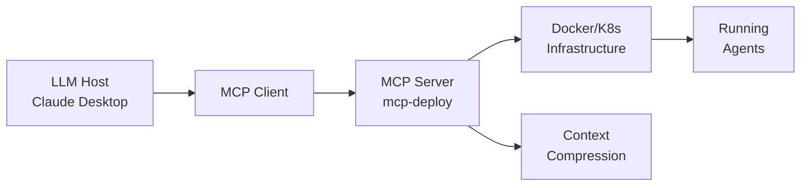

# MCP Overview

**Model Context Protocol (MCP)** is an open standard for connecting LLM applications with external data sources and tools. It enables secure, two-way communication between LLM hosts (like Claude Desktop, Cursor, Windsurf) and MCP servers that provide capabilities.

---

## What is MCP?

MCP separates LLM capabilities from client applications by defining:
- **Hosts**: LLM applications that consume tools (Claude Desktop, etc.)
- **Servers**: Processes that expose tools, resources, and prompts
- **Protocol**: JSON-RPC 2.0 over stdio or HTTP/SSE

Each MCP server can:
- Expose **tools** (functions the LLM can call)
- Expose **resources** (data the LLM can read)
- Provide **prompts** (templates for LLM interactions)

---

## Key Concepts

### Tools
Functions with defined parameters that LLMs can invoke. Each tool has:
- `name` (unique identifier)
- `description` (LLM-facing docstring)
- `inputSchema` (JSON schema for arguments)

```json
{
  "name": "search_web",
  "description": "Search the web for current information",
  "inputSchema": {
    "type": "object",
    "properties": {
      "query": {
        "type": "string",
        "description": "Search query"
      }
    },
    "required": ["query"]
  }
}
```

### Resources
Read-only data endpoints exposed by servers. Can be:
- Static files (`.txt`, `.md`, `.json`)
- Dynamic endpoints (`resource://server/data/current`)
- Subscribed to for updates

### Prompts
Pre-defined message templates that LLMs can request. Used for:
- System message construction
- Multi-step workflows
- Context injection

---

## Meridian MCP Ecosystem

### Core Packages

| Package | Purpose | Status | Registry |
|---------|---------|--------|----------|
| `mcp-deploy` | Generate Docker, serverless, and cloud configs for any MCP server | ✅ Production | PyPI |
| `@meridian/context-compression` | Reduce token usage with smart context pruning | ✅ Production | npm |
| `agent-deploy-orchestrator` | Deploy CrewAI/agent workloads with orchestration | ✅ Production | PyPI |

### Integration Pattern



---

## Quick Start: Building an MCP Server

### 1. Define your tools

```python
# server.py
from mcp import Server
from mcp.types import Tool

server = Server("my-server")

@server.list_tools()
async def handle_list_tools() -> list[Tool]:
    return [
        Tool(
            name="hello_world",
            description="Say hello to someone",
            inputSchema={
                "type": "object",
                "properties": {
                    "name": {"type": "string"}
                },
                "required": ["name"]
            }
        )
    ]

@server.call_tool()
async def handle_call_tool(name: str, arguments: dict):
    if name == "hello_world":
        return [{"type": "text", "text": f"Hello, {arguments['name']}!"}]
```

### 2. Configure for Claude Desktop

```json
{
  "mcpServers": {
    "my-server": {
      "command": "python",
      "args": ["/path/to/server.py"]
    }
  }
}
```

### 3. Test locally

```bash
mcp dev server.py  # Uses MCP Inspector
```

---

## Deployment with mcp-deploy

`mcp-deploy` transforms any MCP server into production-ready deployments:

```bash
# Generate Docker config
mcp-deploy --server my-server.py --output docker/

# Generate serverless (AWS Lambda)
mcp-deploy --server my-server.py --output lambda/ --target serverless

# Generate Kubernetes manifests
mcp-deploy --server my-server.py --output k8s/ --target kubernetes
```

Output includes:
- Dockerfile with health checks
- docker-compose.yml for local testing
- README with deployment steps
- Monitoring/observability configs

---

## MCP Client Libraries

### Python
```bash
pip install mcp
```

### JavaScript/TypeScript
```bash
npm install @modelcontextprotocol/sdk
```

### Community Clients
- Claude Desktop (built-in)
- Cursor IDE
- Windsurf
- Continue.dev
- various open-source projects

---

## Common Use Cases

### 1. Data Integration
Expose databases, APIs, or file systems as MCP resources.

### 2. Code Execution
Provide safe sandboxed code execution tools (with strong isolation).

### 3. Web Search
Wrap search APIs (Google, Bing, Brave) as tools.

### 4. Agent Orchestration
Deploy multi-agent systems where each agent is an MCP server.

### 5. Context Management
Compress, summarize, or retrieve relevant context from large corpora.

---

## Security Best Practices

- **Never** run untrusted MCP servers without sandboxing
- Use least-privilege credentials for server-side tools
- Validate all inputs from LLM before execution
- Implement tool-level rate limiting
- Log all tool invocations for audit

---

## Ecosystem Links

- **Official Spec**: https://spec.modelcontextprotocol.io
- **Anthropic MCP Docs**: https://docs.anthropic.com/en/docs/agents-and-tools/mcp
- **MCP GitHub Org**: https://github.com/modelcontextprotocol
- **MCP Servers List**: https://github.com/modelcontextprotocol/servers

---

## Related

- [agent-deploy-mvp.md](agent-deploy-mvp.md) — Deploying agent systems
- [skills/package-publication-prep.md](../skills/package-publication-prep.md) — Package distribution
- [demo-showcase/README.md](../demo-showcase/README.md) — Working examples
- [docs/mcp-deploy/README.md](../docs/mcp-deploy/README.md) — mcp-deploy reference

---

## Related

- **[agent-deploy-mvp.md](agent-deploy-mvp.md)** — Deploy agents with MCP
- **[README.md](README.md)** — Main guide index
- **[skills/package-publication-prep.md](../skills/package-publication-prep.md)** — Package distribution
- **[demo-showcase/README.md](../demo-showcase/README.md)** — Working examples
- **[docs/mcp-deploy/README.md](../docs/mcp-deploy/README.md)** — mcp-deploy reference
